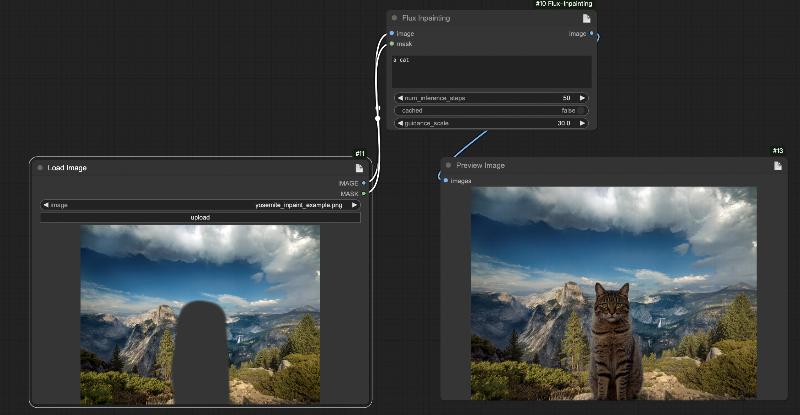
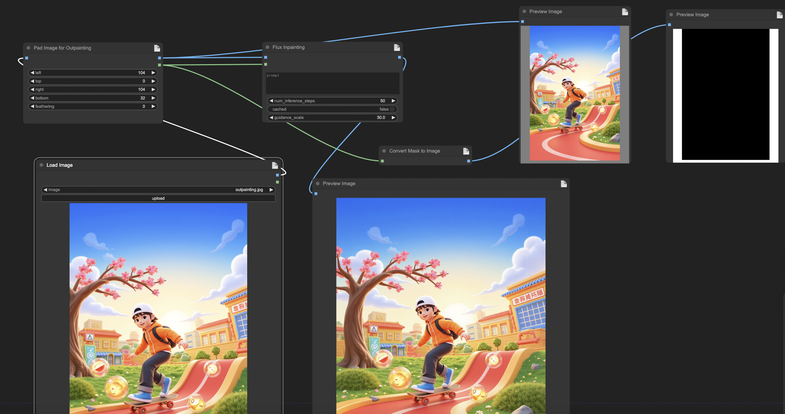
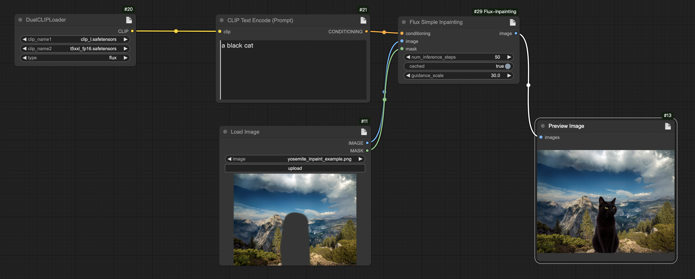
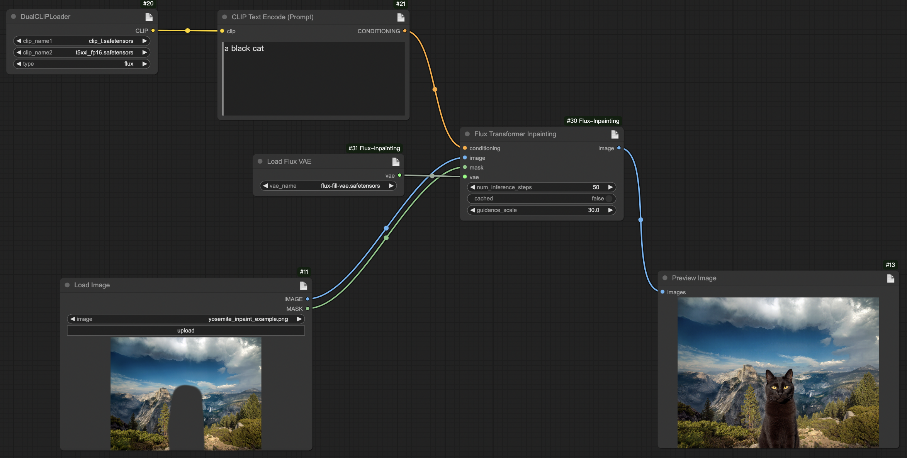
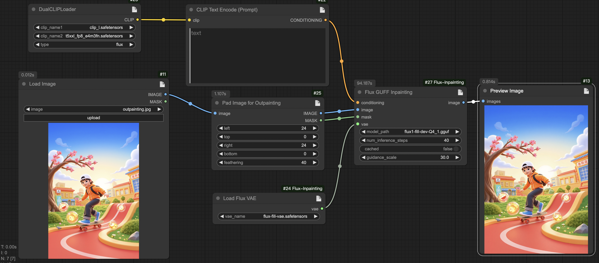

<h1 align="center">ComfyUI-Flux-Inpainting</h1>  

  
## Introduction  
This repository wraps the flux fill model as ComfyUI nodes. Use NF4 flux fill model, support for inpainting and outpainting image. Compared to the flux fill dev model, these nodes can use the flux fill model to perform inpainting and outpainting work under lower VRM conditions<br>  

## News
- Dec 26, 2024: Add `FluxGuffInpainting` node to support loading gguf models<br>
- Dec 11, 2024: Add `FluxSimpleInpainting`, `FluxTransformerInpainting`, `FluxVAELoader` nodes can be used to split pipelines and comfyui clip and vae loader can be used instead<br>

## Installation   
  
#### Method 1:  
  
1. Navigate to the node directory, `ComfyUI/custom_nodes/`  
2. `git clone https://github.com/rubi-du/ComfyUI-Flux-Inpainting.git`  
3. `cd ComfyUI-Flux-Inpainting`  
4. `pip install -r requirements.txt`  
5. Restart ComfyUI  
  
#### Method 2:  
Directly download the node source code package, unzip it into the `custom_nodes` directory, and then restart ComfyUI.  
  
#### Method 3:  
Install via ComfyUI-Manager by searching for "ComfyUI-Flux-Inpainting".  
  
## Usage  
- Example workflows are placed in `ComfyUI-Flux-Inpainting/workflow`.
- `FluxSimpleInpainting` node workflow: [Workflow Address](./workflow/FluxSimpleInpainting.json)  
- `FluxTransformerInpainting` node workflow: [Workflow Address](./workflow/FluxTransformerInpainting.json)  


### Nodes
- FluxInpainting
- FluxSimpleInpainting
- FluxTransformerInpainting
- FluxVAELoader
- FluxGuffInpainting

#### `FluxGuffInpainting` special Instruction
The `FluxGuffInpainting` node only need to load the guff model and put them into the `ComfyUI/models/unet` folder and don't need load other submodels from `FLUX.1-Fil-dev`
vae model download links: https://hf-mirror.com/YarvixPA/FLUX.1-Fill-dev-gguf/tree/main

#### `FluxTransformerInpainting` special instruction
The `FluxTransformerInpainting` node only need to load the transformer submodel from the `FLUX.1-Fil-dev-nf4` model and don't need load other submodels from `FLUX.1-Fil-dev`

#### `FluxVAELoader` special instruction
The `FluxVAELoader` node  need to load the flux fill vae model from the `ComfyUI/models/vae` directory, so you need to download the model and place it in the `ComfyUI/models/vae` directory
vae model download links: https://huggingface.co/black-forest-labs/FLUX.1-Fill-dev/tree/main/vae<br/>  
  
### Models
The node needs to load the transformer and text_decoder_2 submodels from the `FLUX.1-Fil-dev-nf4` model and load other submodels from `FLUX.1-Fil-dev`, so these two models need to be placed in the models folder
<br/>
Model download links:<br/>  
FLUX.1-Fil-dev: https://huggingface.co/black-forest-labs/FLUX.1-Fill-dev<br/>  
FLUX.1-Fil-dev-nf4: https://huggingface.co/sayakpaul/FLUX.1-Fill-dev-nf4<br/> 
FLUX.1-Fill-dev-gguf: https://hf-mirror.com/YarvixPA/FLUX.1-Fill-dev-gguf/tree/main<br/> 
The directory structure is as follows:<br/>  
```
ComfyUI/models/
└── FLUX.1-Fill-dev
    ├── vae
    └── scheduler
    └── text_encoder
    └── ...
└── FLUX.1-Fill-dev-nf4
    ├── transformer
    └── text_decoder_2
```

### Workflows 
Usage of inpainting workflow<br/>  
[Workflow Address](./workflow/inpainting.json)  
  
  
___  
Usage of outpainting workflow<br/>  
[Workflow Address](./workflow/outpainting.json)  
  

___  
Usage of `FluxSimpleInpainting` workflow<br/>  
[Workflow Address](./workflow/FluxSimpleInpainting.json)  
  

___  
Usage of `FluxTransformerInpainting` workflow<br/>  
[Workflow Address](./workflow/FluxTransformerInpainting.json)  
  

___  
Usage of `FluxGuffInpainting` workflow<br/>  
[Workflow Address](./workflow/FluxGuffInpainting.json)  
  
